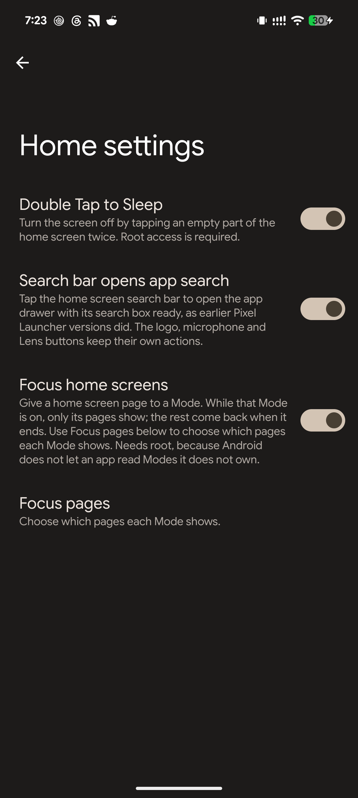
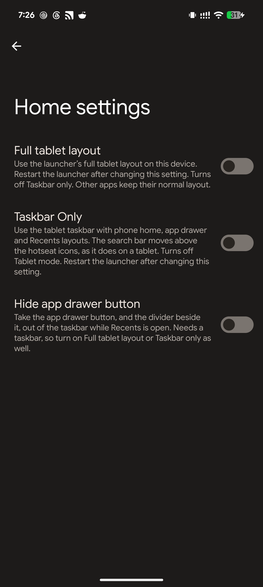
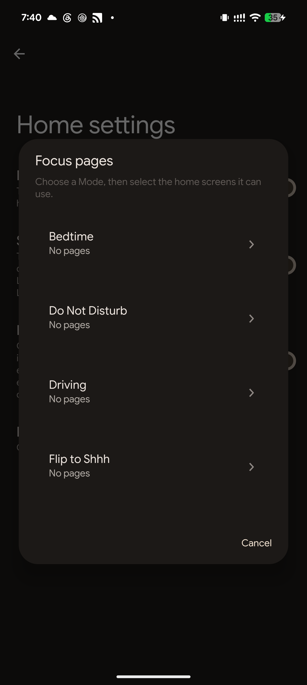
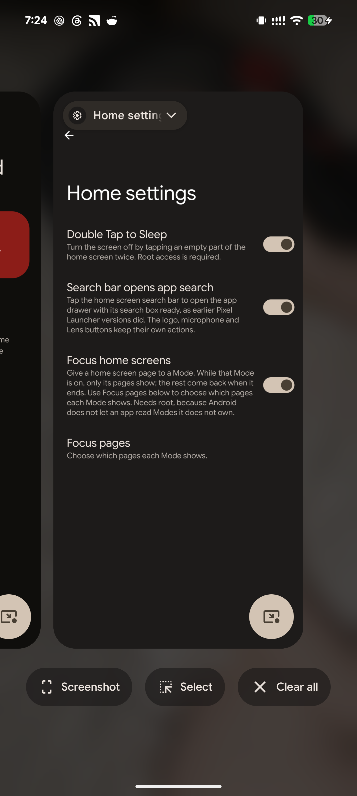
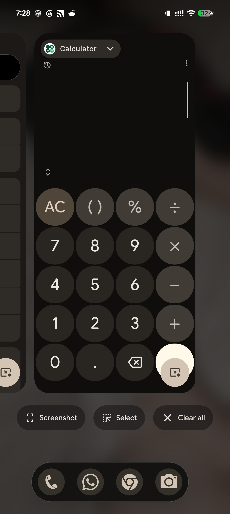

# Pixel Launcher Evolved

An Xposed module that adds the controls the Android 17 Pixel Launcher does not
ship, and puts them where a person already goes to change how home behaves: long
press an empty part of the home screen, tap **Home settings**, and scroll to
**Pixel Launcher Evolved** at the bottom of the launcher's own list.

Overview tweaks apply to the running launcher. The layout tweaks are off by
default and require **Restart Launcher** after enabling or disabling them,
because the launcher builds its device profiles once at startup.

## Screenshots

| | |
|---|---|
|  |  |
| **Home Screen**, inside the launcher's own settings. Double Tap to Sleep, Search bar opens app search, Focus home screens, and the Focus pages chooser. | **Tablet Layout.** Full tablet layout and Taskbar Only are alternatives; Hide app drawer button needs one of them. |
|  |  |
| **Focus pages**, step one. Every Mode on the device, with what it has been given so far. Picking one opens live previews of the home screens to choose from. | **Overview.** The Bubble button sits at the bottom-right of each card, and **Clear all** joins Screenshot and Select in the action row. |
|  | |
| **Taskbar Only**, with **Hide app drawer button** on. The taskbar keeps phone layouts everywhere else, and its app drawer button and divider are gone while Recents is open. | |

Captured on a Pixel 8 Pro running Android 17.

## Features

### Home Screen

| Tweak | What it does |
|---|---|
| Double Tap to Sleep | Sends the power-key event through `su` after two taps on empty workspace. Root permission belongs to this module app; the launcher never receives root access. |
| Focus home screens | Gives a home screen page to one of the device's Modes — Bedtime, Driving, Sleeping, whatever you have. While that Mode is on, only its pages show; when it ends, the ordinary pages come back and its own go away. Use **Focus pages** under Home settings to assign it. |
| Search bar opens app search | Tapping the home screen search bar opens the app drawer with its search box focused, as earlier Pixel Launcher versions did, instead of handing the tap to the Google app. The bar's own buttons — the logo, the microphone and Lens — keep their actions, and a long press still picks the widget up. |

**Focus home screens** filters the model the launcher builds its workspace from.
The database is never written, so a hidden page is hidden the way a page scrolled
off the side is hidden — turning the Mode off brings it back exactly as it was.

What is filtered is the items, not a list of screens, because the launcher keeps
no such list: `collectWorkspaceScreens` walks the items, takes the ones sitting
on the workspace and collects the screens they name. A page with no items left is
a page never asked for. The launcher is handed a second model around a second
map rather than its own — the model's `copy()` hands back the very same map, and
it is shared with the loader and with the code that writes.

Three things follow from that:

- The launcher prunes screens it finds empty and saves the result. While a Mode
  is on, the screens it was not shown are absent rather than empty, so that
  pruning is held off. If the pruning cannot be found at all, the feature
  refuses to install rather than risk deleting a page it hid.
- Reading Modes needs root. Android only reports the Modes an app created
  itself: `getAutomaticZenRules` returns nothing for the Modes a person actually
  has, which belong to the system, to Wellbeing, to GMS and to Settings
  Intelligence. So this module's own app reads them out of the notification
  service's own dump and answers the launcher through a content provider that
  serves no other caller.
- The launcher creates its first screen before it is told what to show. The
  feature skips that screen when the active Mode does not own it, avoiding an
  empty page at the front.

Modes are looked at when the launcher comes back to the front, and whenever Do
Not Disturb changes. Nothing polls on a timer. A Mode that changes while the home
screen is already showing applies on the next return to it, unless it moved Do
Not Disturb, which most do — Driving and Transit are the ones that do not.

### Overview

| Tweak | What it does |
|---|---|
| Show Bubble launcher button | Adds a Material 3 medium FAB to the bottom-right of each Recents card. Tapping it puts Overview away — back to the app you came from, or to home — and reopens the card's app as a floating bubble. |
| Show Clear all button | Adds a Clear all button beside Screenshot and Select. The stock row has none. |
| Hide Screenshot button | Removes the Screenshot button from the Recents action row. |
| Hide Select button | Removes the Select button from the Recents action row. |

### Tablet Layout

**Full tablet layout** enables the launcher's large-screen layout and taskbar decisions
without changing system density or other apps. It also changes the grid, which
means the launcher has to migrate the workspace; a workspace it cannot carry
across comes back empty. Tablet grids can make widgets and labels cramped on a
phone. Switching it off and restarting restores stock device classification.

**Taskbar Only** takes the taskbar and leaves the grid alone. The home
screen, the app drawer and Recents keep their phone measurements, the workspace
is never migrated, and the taskbar is sized by the launcher itself rather than
by this module. The search bar moves above the hotseat icons, which is where
tablet mode puts it as well. Returning to home settles the taskbar icons onto
the hotseat rather than stepping onto it, which needs the launcher to be asked
the right one of the two device profiles it keeps, the taskbar carries one icon
per hotseat slot so every icon travels instead of the last one appearing once
the animation has finished, and the icons come out of the stashed pill whole
rather than splitting open across the middle.

The two are alternatives, and switching one on switches the other off. Either
way, the taskbar is kept out of the app's own transition into Overview: the
window manager lends that window to the app for the length of a recents
animation, which on a phone would otherwise draw the taskbar across the bottom
of the shrinking app card before it snapped back into place.

**Hide app drawer button** removes the taskbar app drawer button and its divider
only while Overview is open. What is left is re-centred, because the launcher
sizes the row by counting children rather than visible ones and would otherwise
leave the icons sitting where the removed pair used to end.

### Everywhere

A **Restart Launcher** row at the end of the section, for when a hooked process
needs a clean slate. The launcher ends its own process, and Android brings the
home app straight back.

The module's own app is not in the app drawer. Every setting is in the
launcher's own Home settings, so an icon there would open a screen with nothing
to change. The app itself stays —
it is what holds root, and its screen still answers the one question Home
settings cannot, whether a framework accepted the module — and an Xposed
manager can still open it by name.

## Requirements

| | |
|---|---|
| Android | 17 (API 37) |
| Launcher | Pixel Launcher (`com.google.android.apps.nexuslauncher`) |
| Framework | [Vector](https://github.com/JingMatrix/Vector) v2.2 or newer, or any framework implementing libxposed API 101+ |
| Root | Required for Double tap to sleep and Focus home screens |

Built against the modern [libxposed API](https://github.com/libxposed/api)
(`io.github.libxposed:api`), not the legacy `de.robv.android.xposed` bridge.

## Install

1. Install the APK from [Releases](https://github.com/MrxSiN/PixelLauncherEvolved/releases).
2. Enable **Pixel Launcher Evolved** in your Xposed manager. The module declares
   a static scope, so there is no scope to pick.
3. Force-stop the Pixel Launcher once, so it loads the module.
4. Long press an empty part of the home screen, tap **Home settings**, and scroll
   to the bottom.

Open the module's app to check that a framework has accepted it. Settings stored
by earlier versions are carried across the first time the launcher loads this
one.

## How it works

Settings live in one preference file in the launcher's own data directory, so
what draws the switches and what reads them are the same process:

```
Home settings section  --write-->  pixel_launcher_evolved.xml  <--read--  features
                                   (launcher data directory)
```

That is what makes a change apply without a restart. A feature that can react to
a running launcher declares itself live: it is installed whatever its setting
says, and reads that setting from inside its hooks. Overview lays out again
constantly, so the next frame reflects the new value, and switching a tweak off
restores what it changed rather than leaving it applied until the next start.

Opening that file needs a `Context`, and the module is loaded before the process
has one. Installation intercepts `LauncherApplication.onCreate` after Android
attaches its base context, then installs hooks before launcher startup code can
initialize device profiles.

The section itself is built from the launcher's own `androidx.preference`
classes, reached by reflection because a `SwitchPreference` compiled here would
be a different type from the one the screen accepts. Titles and summaries are
read from this module's APK with `getResourcesForApplication`, so they are still
written once, in `strings.xml`.

Both sides describe a tweak once, in `catalog/`: the section renders from that
list and the hooks read the same `Setting` objects, so a key cannot drift
between them.

`HOOK_NOTES.md` records the launcher internals each feature relies on and how
they were verified on a device.

## Build

```bash
./gradlew clean assembleRelease
```

A local release build is unsigned unless `ANDROID_KEYSTORE_PATH`,
`ANDROID_KEYSTORE_ALIAS`, `ANDROID_KEYSTORE_PASSWORD`, and `ANDROID_KEY_PASSWORD`
are set. `scripts/check-project.sh` runs the static invariants that CI enforces.

Release builds are shrunk with R8; the module entry class is kept by name because
the framework resolves it from `META-INF/xposed/java_init.list` rather than from
any call site.

## Design

```
PixelLauncherEvolvedModule   Xposed entry: recognises the launcher, hands off
PixelLauncherEvolvedApp      app entry: binds to the framework service
catalog/                     every tweak described once, shared by both sides
settings/                    where a setting is stored, and how it is read
hook/                        the feature contract, context, startup and registry
feature/                     one package per area; each feature installs itself
ui/                          the module's own screen: module status, and a way in
```

Adding a tweak means adding a `LauncherFeature`, a `Setting`, and one line in
`FeatureRegistry` and `FeatureCatalog`. Nothing existing changes, and no feature
knows about any other — the settings section included, since it renders whatever
the catalog holds.

Features depend on contracts (`BubbleLauncher`, `TaskTargetResolver`,
`OverviewCloser`, `SettingsSource`) rather than on reflection details, so a
launcher change is absorbed by one implementation class.

## Licence

GNU General Public License v3.0. See `LICENSE` and `NOTICE.md`.
