<div align="center">


# Pixel Launcher Evolved

**The controls the Android 17 Pixel Launcher does not ship — put where you already go to change how home behaves.**

Long press an empty part of the home screen → **Home settings** → **Pixel Launcher Evolved**.

<br>

[](https://github.com/MrxSiN/PixelLauncherEvolved/releases)
[](https://github.com/MrxSiN/PixelLauncherEvolved/releases)
[](https://developer.android.com)
[](#compatibility)
[](LICENSE)

</div>

---

> [!NOTE]
> **Fully compatible with the latest Android release — Android 17 QPR1 (September 2026),
> build `CP3A.260905.009`, Pixel Launcher `907`.** Every launcher member the module stands on
> resolves (57 of 57, no fallbacks), and every tweak is available. Tested on a Pixel 8 Pro with
> Vector v2.2. The module checks this itself on every launcher start: see
> [Compatibility](#compatibility).

<table>
<tr>
<td align="center"><br><sub>A section of the launcher's own Home settings</sub></td>
<td align="center">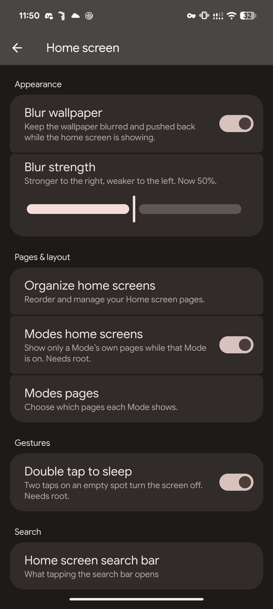<br><sub>Pages drawn the way Android 17 Settings draws them</sub></td>
<td align="center">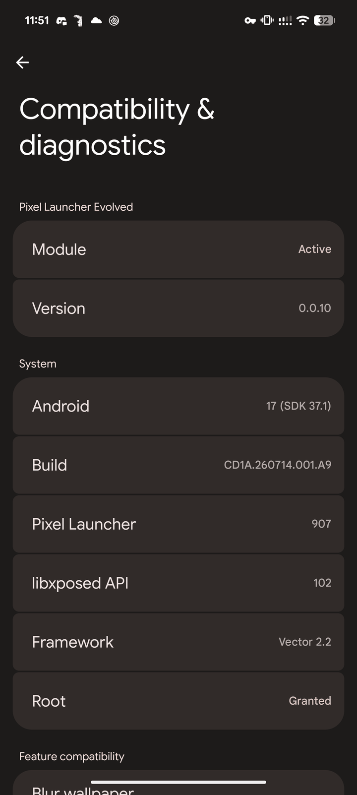<br><sub>Compatibility &amp; diagnostics</sub></td>
</tr>
</table>

## Why it works this way

Most launcher modules hand you a second settings app. This one has no screen of its own. Every
tweak is a row in the launcher's **own** Home settings, drawn with the launcher's own preference
classes as Material 3 Expressive cards, and stored in the launcher's own data directory — so the
code that draws a switch and the code that reads it are the same process, and a change reaches the
running launcher on the next frame.

|  | |
|---|---|
| 🧭 **Where you already are** | Home settings → Pixel Launcher Evolved. Pages, groups and cards look and move like Android 17 QPR1 Settings. |
| ⚡ **Live** | Overview, home screen and app drawer tweaks apply immediately. Switching one off restores exactly what it changed. |
| 🛡 **Knows the launcher it runs in** | Each tweak declares the launcher members it needs. On a launcher build that lacks them the tweak is not installed and its switch says so, instead of doing nothing. |
| 🚑 **Safe Mode** | Three launcher crashes within a minute turn the experimental layout modes off before they load again. |
| 🔁 **No force-stop to update** | After a new build is installed, the launcher restarts itself the next time the screen goes off. |
| 🔒 **Root stays put** | Root belongs to this module's app. The launcher never receives it. |
| 🧩 **Contained** | Each tweak is a `LauncherFeature`. One failing feature cannot take the others down. |

---

## Features

<details open>
<summary><b>🏠 Home screen</b></summary>
<br>

| Group | Tweak | What it does | Root |
|---|---|---|:---:|
| Appearance | **Blur wallpaper** | Keeps the wallpaper blurred and pushed back while the home screen is showing, with the launcher's own blur. A deeper state deepens the blur rather than stacking a second one. | — |
| Appearance | **Blur strength** | From nothing to the deepest the launcher's own blur goes. Greyed out while Blur wallpaper is off. | — |
| Pages & layout | **Organize home screens** | Reorder and manage your Home screen pages. Every page on one screen, including pages a Mode hides, marked with that Mode. Touch and hold a page, then drag it into place; the order is saved when you leave. The first page keeps At a Glance, so it stays first. | — |
| Pages & layout | **Modes home screens** | Gives home screen pages to one of the device's Modes — Bedtime, Driving, Sleeping, whatever you have. While that Mode is on, only its pages show; when it ends, the ordinary pages come back. | ✅ |
| Pages & layout | **Modes pages** | Choose which pages each Mode shows, from live previews of each page. | ✅ |
| Gestures | **Double tap to sleep** | Two taps on an empty spot turn the screen off. | ✅ |
| Search | **Home screen search bar** | A page of its own. **Search bar opens app search** makes the home search bar open the app drawer with its search box focused, instead of the Google app. The bar's own buttons keep their actions. | — |

<table>
<tr>
<td align="center"><br><sub>Home screen</sub></td>
<td align="center">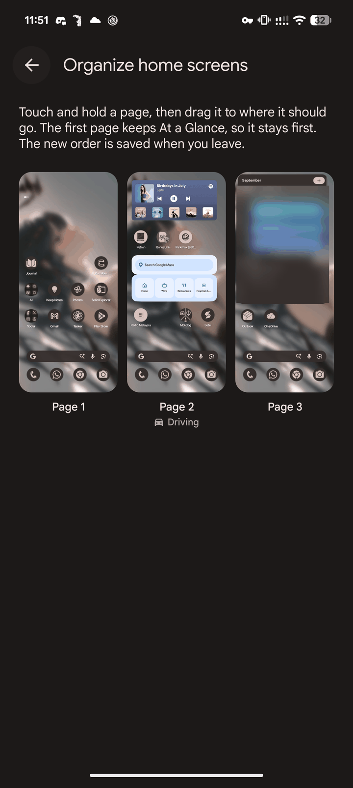<br><sub>Organize home screens</sub></td>
<td align="center">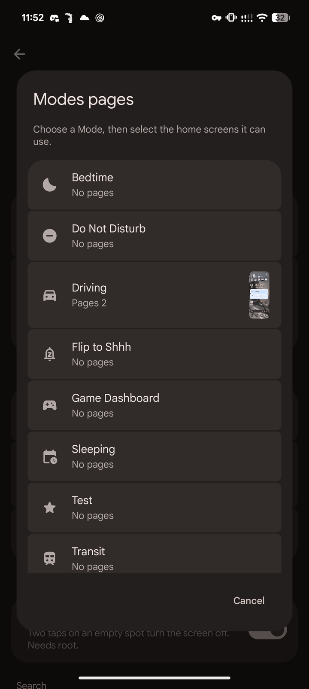<br><sub>Modes pages: the Modes</sub></td>
</tr>
<tr>
<td align="center">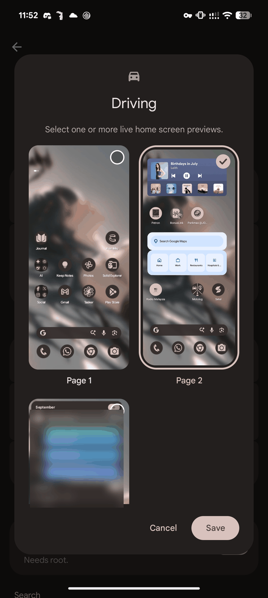<br><sub>Modes pages: choosing a Mode's pages</sub></td>
<td></td>
<td></td>
</tr>
</table>

</details>

<details open>
<summary><b>🔍 App drawer</b></summary>
<br>

| Group | Tweak | What it does |
|---|---|---|
| Apps | **Hidden apps** | Leaves the apps you pick out of the drawer and out of its search. Tapping it opens the drawer with a tick on every icon: tap the apps to hide, then the button in the corner. |
| Search results | **Web Search** | Google's suggestions for what you typed. Switch off to take the whole group out. |
| Search results | **Play Store** | Apps you could install. |
| Search results | **Search in Apps** | The row that hands your search to Google, YouTube, Maps and the rest. |
| Search results | **Open web results with** | Opens a tapped Web Search result in the app you pick — any app that opens a website link — instead of the Google app. Greyed out while Web Search is off. |

Each switch takes one whole group out — heading and rows together — so the launcher lays out a
shorter list rather than one with a gap in it. Your apps, their shortcuts, Settings results and
tips are untouched.

<table>
<tr>
<td align="center">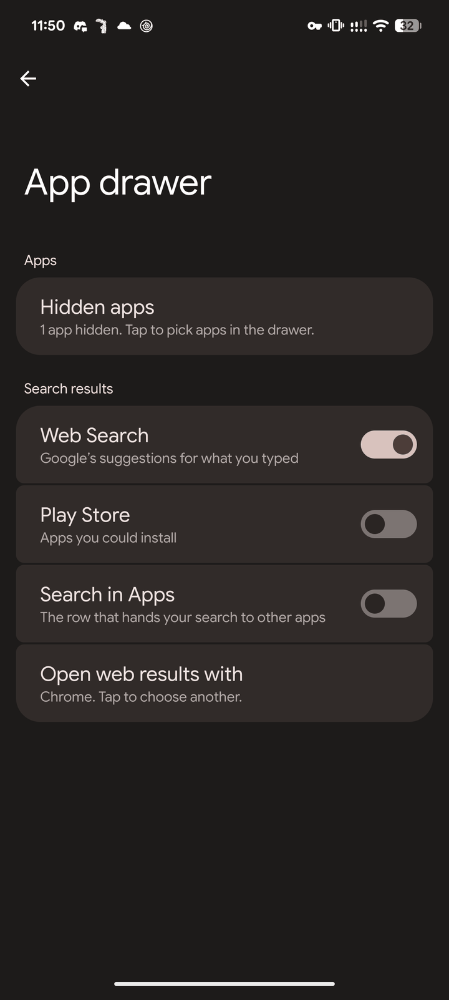<br><sub>App drawer</sub></td>
<td align="center">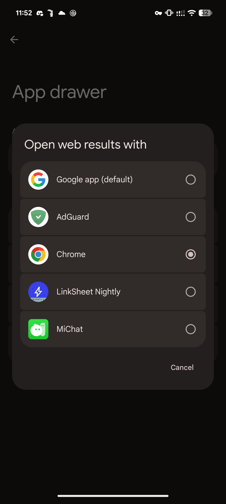<br><sub>Open web results with</sub></td>
</tr>
</table>

</details>

<details open>
<summary><b>🗂 Overview</b></summary>
<br>

| Group | Tweak | What it does |
|---|---|---|
| Actions | **Bubble** | A button on each Recents card that puts Overview away and reopens the card's app as a floating bubble. |
| Actions | **Split screen** | A button on each Recents card that starts the launcher's own split selection with that app. |
| Actions | **Clear all** | Adds Clear all beside Screenshot and Select. The stock row has none. |
| Actions | **Screenshot** | Shows Screenshot in the Recents action row. |
| Actions | **Select** | Shows Select in the Recents action row. |

<table>
<tr>
<td align="center">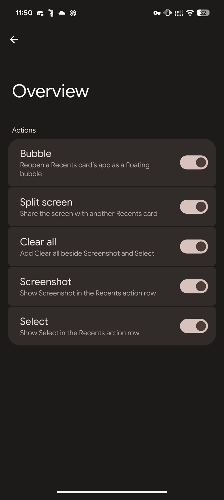<br><sub>Overview</sub></td>
</tr>
</table>

</details>

<details open>
<summary><b>📐 Layout &amp; taskbar</b></summary>
<br>

**Layout mode** is one choice of four, as radio buttons. Layout modes are read once at startup,
so a new choice applies after **Restart Pixel Launcher**.

| Layout mode | What it does |
|---|---|
| **Default** | The normal Pixel Launcher layout. |
| **Overview only** | The tablet-style Overview grid. The home screen, app drawer and every other surface keep their phone measurements, and no taskbar appears. |
| **Taskbar only** | The tablet taskbar with the phone layout. Home, app drawer and Recents keep their phone measurements, and the workspace is never migrated. |
| **Full tablet layout** | The launcher's large-screen classification, which decides the grid and the taskbar together. The workspace is migrated to the tablet grid. |

| Group | Tweak | What it does |
|---|---|---|
| Taskbar | **App drawer button** | Keeps the taskbar's app drawer button and its divider while Recents is open. Switch off to take them out and re-centre what is left. |

<table>
<tr>
<td align="center">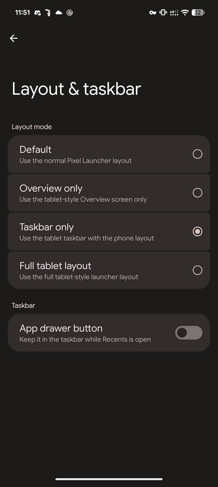<br><sub>Layout &amp; taskbar</sub></td>
</tr>
</table>

</details>

<details open>
<summary><b>⚙️ Advanced</b></summary>
<br>

| Group | Row | What it does |
|---|---|---|
|  | **Restart Pixel Launcher** | Asks first, then ends the launcher process; Android brings the home app straight back. |
|  | **Compatibility & diagnostics** | What is running, and what of the launcher each tweak found. See [Compatibility](#compatibility). |
| Backup & restore | **Export settings** | Saves every tweak to a JSON file through the system file picker — to your phone, Drive, anywhere. |
| Backup & restore | **Import settings** | Replaces every tweak with the ones in a file, after asking, then offers the restart a layout mode needs. |
| Backup & restore | **Reset all tweaks** | Puts every tweak back to its default, after asking. |

A backup is a portable, readable configuration:

```json
{
  "version": 1,
  "blur": true,
  "blurStrength": 0.5,
  "hideWebSearch": true,
  "overviewClearAll": true,
  "layoutMode": "taskbarOnly",
  "hiddenApps": ["org.telegram.messenger"],
  "webSearchApp": "com.android.chrome"
}
```

A name the file leaves out takes its default, and a name this version does not know is ignored.
Modes pages and the page order are not in it: both are tied to this phone's launcher database and
Modes, and import and reset leave them as they are.

<table>
<tr>
<td align="center">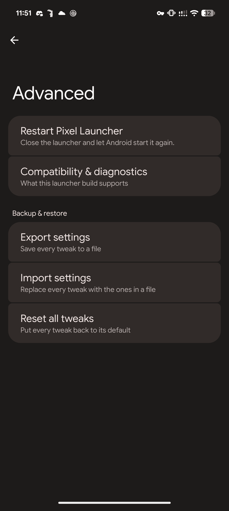<br><sub>Advanced</sub></td>
<td align="center">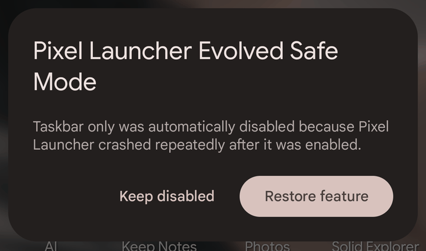<br><sub>Safe Mode, after a crash loop</sub></td>
</tr>
</table>

</details>

---

## Compatibility

Pixel Launcher is updated with every monthly Android release, and its internals move. This module
does not assume they stayed put.

- **Launcher contracts.** Every class, method and field a tweak stands on is listed once, with the
  signature this module expects and the older one it falls back to. They are checked against the
  running launcher when it starts.
- **Per-feature gating.** A tweak whose required members are missing is not installed at all. Its
  switch is greyed out and reads *Unavailable on Pixel Launcher 910. Launcher internals changed.
  Update Pixel Launcher Evolved.* Nothing stored changes, so the tweak comes back by itself once an
  update brings its members back.
- **Automatic analysis.** The first time a new launcher `versionCode` starts, the full report is
  written to logcat — `adb logcat -s PixelLauncherEvolved`:

  ```
  Pixel Launcher versionCode: 907
  Resolved 57 / 57, fallback signatures 0, failed 0

  Contracts
  ✓ TaskView.onFinishInflate()
  ✓ TaskView.onLayout(boolean, int, int, int, int)
  ✓ ActivityAllAppsContainerView.setSearchResults(ArrayList, boolean)
  ✓ Snackbar.show(ActivityContext, CharSequence, int, Runnable, Runnable)
  ...
  ```

- **Compatibility & diagnostics** shows the module and framework versions, Android, build, the
  launcher's `versionCode`, the libxposed API, root, each feature's status, hook counts and every
  contract — with **Copy compatibility report** for a bug report.
- **Safe Mode.** Every uncaught launcher crash is written down as it happens. Three within 60
  seconds switch the experimental layout mode off before any tweak installs on the next start, and
  the home screen asks whether to restore it or keep it disabled.

<table>
<tr>
<td align="center"><br><sub>Module and system</sub></td>
<td align="center">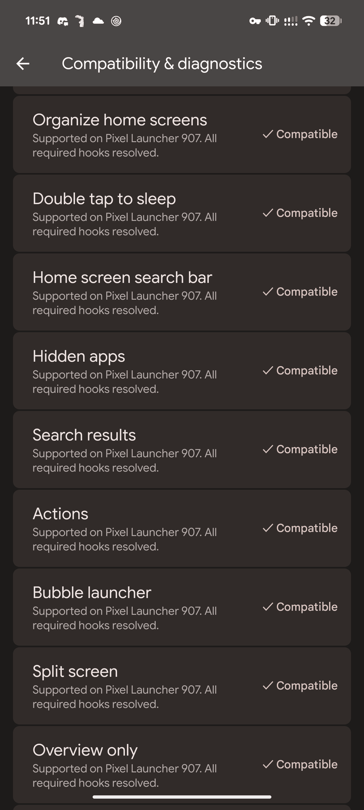<br><sub>Feature compatibility</sub></td>
</tr>
</table>

---

## Requirements

| | |
|---|---|
| **Android** | 17 (API 37). Fully compatible with 17 QPR1, September 2026 (`CP3A.260905.009`) |
| **Launcher** | Pixel Launcher (`com.google.android.apps.nexuslauncher`), tested on `versionCode` 907 |
| **Device** | Pixel (tested on Pixel 8 Pro) |
| **Framework** | [Vector](https://github.com/JingMatrix/Vector) v2.2+, or any framework implementing libxposed API 101+ |
| **Root** | Required for Double tap to sleep and Modes home screens |

Built against the modern [libxposed API](https://github.com/libxposed/api)
(`io.github.libxposed:api`), not the legacy `de.robv.android.xposed` bridge.

## Install

```
1. Install the APK from Releases
2. Enable Pixel Launcher Evolved in your Xposed manager
3. Grant it root, if you want the two tweaks that need it
4. Force-stop the Pixel Launcher once
5. Long press home → Home settings → Pixel Launcher Evolved
```

The module declares a **static scope**, so there is nothing to pick. It has no icon in the app
drawer and no screen of its own. Settings stored by earlier versions are carried across.

Updating needs no force-stop: after a new build is installed, the launcher restarts itself the
next time the screen goes off.

---

## How it works

Settings live in one preference file in the launcher's own data directory, in device protected
storage so they load before the first unlock:

```
Home settings pages  ──write──▶  pixel_launcher_evolved.xml  ◀──read──  features
                                  (launcher data directory)
```

A feature that can react to a running launcher declares itself **live**: it is installed whatever
its setting says and reads that setting from inside its hooks, so the next frame reflects the new
value. Installation intercepts `LauncherApplication.onCreate` once the base context is attached,
records crashes for Safe Mode, checks the launcher contracts, then installs every compatible
feature before launcher startup code initialises device profiles.

The pages are built from the launcher's own `androidx.preference` classes, reached by reflection
because a `SwitchPreference` compiled here would be a different type from the one the screen
accepts. Their cards, radio buttons and status values are drawn at bind time; titles and summaries
are read from this module's APK with `getResourcesForApplication`, so they are written once, in
`strings.xml`. Organize home screens and the dialogs are drawn with the same Material 3 Expressive
palette, shapes and type, and move on Material's shared axis with predictive back.

<details>
<summary><b>Modes home screens, in detail</b></summary>
<br>

It filters the model the launcher builds its workspace from. The database is never written, so a
hidden page is hidden the way a page scrolled off the side is hidden — turning the Mode off brings
it back exactly as it was.

What is filtered is the **items**, not a list of screens, because the launcher keeps no such list:
`collectWorkspaceScreens` walks the items and collects the screens they name. The launcher is
handed a second model around a second map rather than its own — the model's `copy()` hands back
the very same map.

- A page exists because an item names it, so nothing the launcher saves can delete a page it was
  not shown. A removed page is dropped from every Mode, so a new page that reuses its id does not
  quietly belong to one. A Mode deleted in Settings gives its pages back.
- **Reading Modes needs root.** Android only reports the Modes an app created itself, so this
  module's own app reads them out of the notification service's dump and answers the launcher
  through a content provider that serves no other caller.
- Modes are looked at whenever the launcher regains window focus and whenever the zen
  configuration changes. Nothing polls on a timer, and Driving and Transit work even though they do
  not change Do Not Disturb.

</details>

`HOOK_NOTES.md` records the launcher internals each feature relies on, and how they were verified
on a device.

---

## Build

```bash
./gradlew testDebugUnitTest assembleRelease
```

A local release build is unsigned unless `ANDROID_KEYSTORE_PATH`, `ANDROID_KEYSTORE_ALIAS`,
`ANDROID_KEYSTORE_PASSWORD` and `ANDROID_KEY_PASSWORD` are set. `scripts/check-project.sh` runs the
static invariants that CI enforces. Release builds are shrunk with R8; the module entry class is
kept by name, because the framework resolves it from `META-INF/xposed/java_init.list`.

## Design

```
PixelLauncherEvolvedModule   Xposed entry: recognises the launcher, hands off
catalog/                     every switch and layout mode described once
settings/                    where a setting is stored, and how it is read
safemode/                    crash loop detection and recovery
diagnostics/                 launcher contracts, the analyzer and its report
hook/                        the feature contract, context, startup and registry
feature/                     one package per area; each feature installs itself
  settings/                  Home settings pages, rows and Expressive drawing
  backup/                    export, import and reset
focus/                       Modes, pages, and the provider that answers for them
lock/                        the root-backed endpoint that turns the screen off
```

Adding a tweak means adding a `LauncherFeature` with the `CompatibilityFeature` it needs, a
`Setting`, its contracts in `LauncherContracts`, and one line each in `FeatureRegistry`,
`FeatureCatalog` and `SettingsPages`. Nothing existing changes. Unit tests hold the contracts to
the feature sources, every feature to a compatibility entry, and every switch to a name in the
backup format.

---

<div align="center">

**GNU General Public License v3.0** · see [`LICENSE`](LICENSE) and [`NOTICE.md`](NOTICE.md)

</div>
